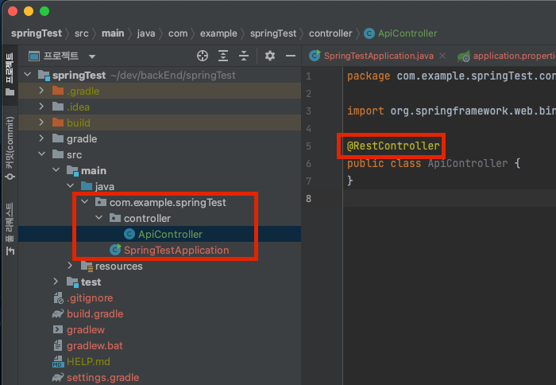

 # Spring 시작
## 1. 준비하기
### 1) Spring Boot 주요 특징
1. java -jar로 실행하는 java 어플리케이션을 만들 수 있다.
2. Build Tool : `Maven` vs `Gradle`
3. Servlet Containers : `Tomcat` vs `Jetty` vs `Undertow` vs `Netty`

### 2. REST Client 설치 하기
- Talend API Clinent :  Chorme 확장 기능으로 설치 가능
- CRUD를 테스트하기 위해 사용하는 Tool

## 2. 시작하기

### 1) Spring initializr [[홈페이지](https://start.spring.io)]
- IntelliJ Community버전에서는 Spring Assistant가 제공되지 않기 때문에, 프로젝트 시작을 위해서는 별도로 생성해야만함.
    1. `Gradie` Project로 생성
    2. dependency로 `Lombok`, `Spring WEB` 선택 
    3. `java 17` 버전 선택

### 2) 기본 세팅
- 포트 변경 : `src/resources/application.properties`에 설정 추가
    ```java
        server.port = 9090
    ```
- API 설정
- `Controller` 패키지를 추가하여 `ApiController` 클래스 생성
    - `@RestController` 지정
    
    - `@RequestMapping("주소")` 지정 : 요청받는 URI 생성
    - `@GetMapping("명령(매소드)")` 지정 : 응답할 메소드 생성
        ```java
        // URI 지정
        @RestController //해당 Class는 REST API 처리하는 Controller
        @RequestMapping("/api") // RequestMapping은 URI를 지정해주는 Annotation
        public class ApiController {

        // 응답
        @GetMapping("/hello") //http://localhost:9090/api/hello 로 접속하면 출력 가능!
        public String hello(){
            return "hello spring boot!";
        }
        ```
### 3) Controller

